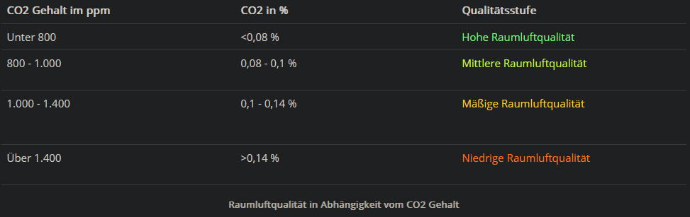

# Projekt Eingebettete Systeme
PTI09450 - Westsächsische Hochschule Zwickau

## 1. Problemstellung
Die Konzentration von CO2 hat einen hohen Einfluss auf den Menschen. Eine hohe CO2 Konzentration kann etwa zu Müdigkeit führen, die Konzentrationsfähigkeit senken oder die Gesundheit beeinträchtigen und ist ein Indiz für eine hohe Anzahl von Aerosolen und Keimen in der Luft. Besonders in Wohn- und Arbeitsräumen ist daher eine gute Luftqualität, wie durch regelmäßiges Lüften, essenziell.

Die Europäische Norm EN 13779 bewertet die Konzentration von CO2 in Innenräumen in vier Qualitätsstufen (siehe Tabelle 1). Als hygienisch inakzeptabel gilt die Raumluftqualität ab 2.000 ppm. [^1]

Zur Überwachung von Räumen können Sensoren eingesetzt werden, welche die Konzentration von CO2 mit NDIR (Infrarot) oder chemischen Sensoren messen können. Viele der Messgräte auf dem Markt nutzen Infrarotsensoren, da diese langlebiger sind. [^2]

Trotz der hohen Relevanz einer guten Luftqualität ist der Preis für CO2-Messgeräte, auch CO2-Ampel, hoch. Dies liegt unter Anderem am hohen Preis von NDIR CO2 Sensoren (z.B. etwa 66€ für einen [SCD30 
Sensor](https://www.mouser.de/ProductDetail/Sensirion/SCD30?qs=rrS6PyfT74fdywu4FxpYjQ%3D%3D)). Im Vergleich dazu kosten chemische Sensoren
nur einen Bruchteil dessen (z.B. 3,20€ für einen [MQ-135 Gas Sensor](https://www.makershop.de/sensoren/gas/mq-135/) oder 28,90€ für einen [SGP30  Luftqualitätssensor](https://www.makershop.de/sensoren/gas/adafruit-sgp30/)) und eignen sich daher gut für Do-It-Yourself Projekte.

[^1]: https://www.cik-solutions.com/anwendungen/co2-im-innenraum/
[^2]: https://www.lueftungsland.de/blog/275/wie-funktioniert-ein-co2-messgeraet.html#hoemeet

## 2. Zielsetzung
Ziel soll es sein, einen Luftqualitätssensor umzusetzen, der mittels einer LED eine "CO2-Ampel" bildet und alle Sensorwerte über das Zigbee-Protokoll an eine lokale HomeAssistant Instanz übermittelt.

## 3. Methode
Als Basis des Projekts dient ein NodeMCU Entwicklerboard auf Basis des ESP8266 Mikrocontrollers. Zur Verbindung via Zigbee dient ein CC2530 Funkmodul, für die CO2 Messung wird ein MQ-135 Gas Sensor eingesetzt.

Die Komponenten werden gemeinsam auf einer Steckplatine zusammengebaut. Eine Software wird entwickelt und sorgt dafür, dass die Sensorwerte ausgelesen, übermittelt und mittels LED und einem e-Paper dargestellt werden können. Als Programmiersprachen kommen für dieses Projekt MicroPython oder C++ (Arduino IDE) in Frage, die Entscheidung dazu hängt vom Vorhandensein notwendiger Bibliotheken (E-Paper & RF-Modul) ab.

## 4. Material
Zur Umsetzung des Projekts sind diverse Hardwarekomponenten notwendig. Diese sind nachfolgend aufgelistet.

- [NodeMCU ESP8266 Entwicklerboard](https://www.makershop.de/plattformen/esp8266/nodemcu-esp8266-dev-kit/)
- [2.9 Inch Waveshare e-Paper Display](https://www.waveshare.com/product/displays/e-paper/epaper-2/2.9inch-e-paper-module.htm)
- [CC2530 RF-Modul](https://de.aliexpress.com/item/1005002293554192.html)
- [MQ-135 Gas Sensor](https://www.az-delivery.de/products/mq-135-gas-sensor-modul) (misst u.a. CO2)
- USB to UART Bridge (alternativ Raspberry Pi)
- diverse Vorwiderstände
- diverse LEDs
- 5V Spannungsversorgung

## 5. Zeitplan & Meilensteine
- 07.11.2022 - Exposé, Projekteinrichtung, "Hello World" für NodeMCU
    - Zusammenstellen der Hardware
    - Recherche
    - Schreiben des Exposé
    - Einrichtung des Git-Repository & IDE
- 21.11.2022 - Auslesen von Sensorwerten via Serial Output
    - Zusammenstellen der Hardware
    - Recherche
    - Erstellen nötiger Skripte
- 05.12.2022 - Ausgabe der Sensorwerte auf ePaper & Darstellung Luftqualität via LED
    - Zusammenstellen der Hardware
    - Recherche
    - Erstellen nötiger Skripte
- 02.01.2023 - Verbindung des CC2530 in das Zigbee-Netz
    - Zusammenstellen der Hardware
    - Recherche
    - Flashen der nötigen Firmware(s)
    - Erstellen nötiger Skripte
- 16.01.2023 - Übermittlung der Sensordaten via Zigbee
    - Erstellen nötiger Skripte
- 23.01.2023 - Optimierung; Projektabnahme
    - Überarbeitung der Skripte

## 6. vorläufiges Literaturverzeichnis
- [Random Nerd Tutorials - ESP8266 Punout Reference](https://randomnerdtutorials.com/esp8266-pinout-reference-gpios/)
- [Zigbee2MQTT - Connecting the CC2530](https://www.zigbee2mqtt.io/guide/adapters/flashing/connecting_cc2530.html)
- [hackster.io - Xbee/Zigbee Setup with Arduino and NodeMCU](https://www.hackster.io/Neutrino-1/xbee-zigbee-setup-with-arduino-and-nodemcu-81f7fa)
- [Waveshare Wiki - 2.9inch e-Paper Module](https://www.waveshare.com/wiki/2.9inch_e-Paper_Module)
- [Github: waveshare - e-Paper](https://github.com/waveshare/e-Paper/tree/master/Arduino/epd2in9)
- [GitHub: DougWilkinson - sensor-mqtt-homeassistant](https://github.com/DougWilkinson/sensor-mqtt-homeassistant)
- [GitHub: mcauser - micropython-waveshare-epaper](https://github.com/mcauser/micropython-waveshare-epaper)